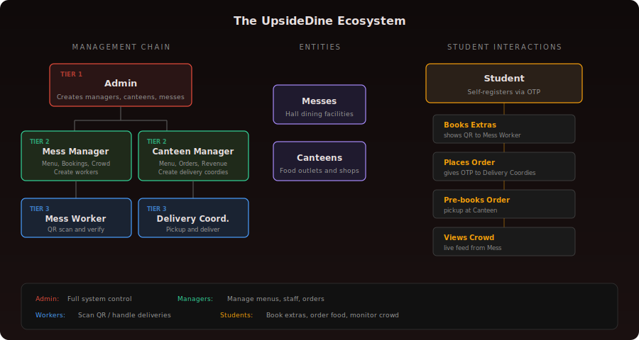
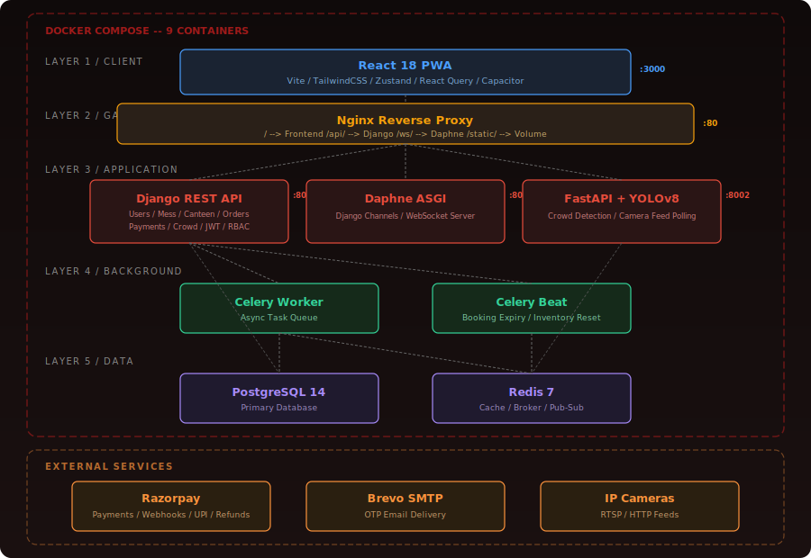
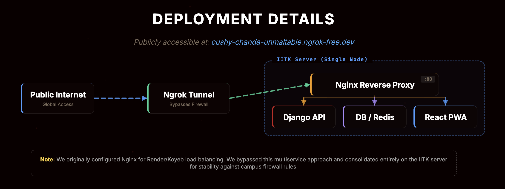
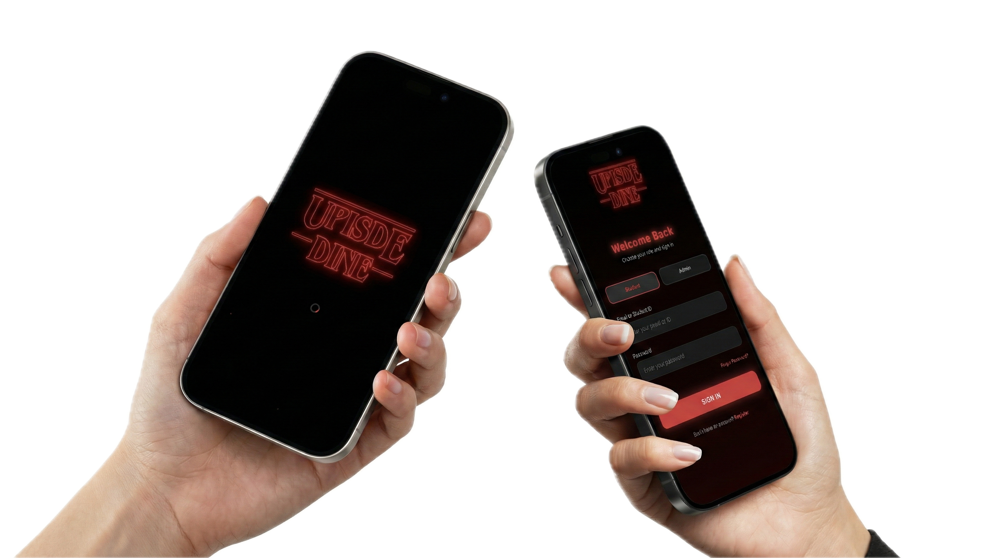
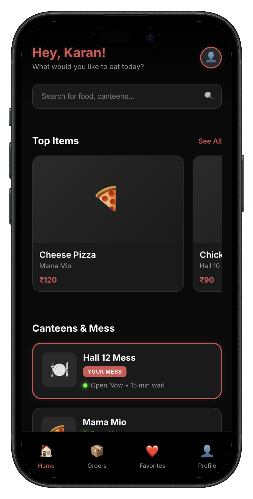
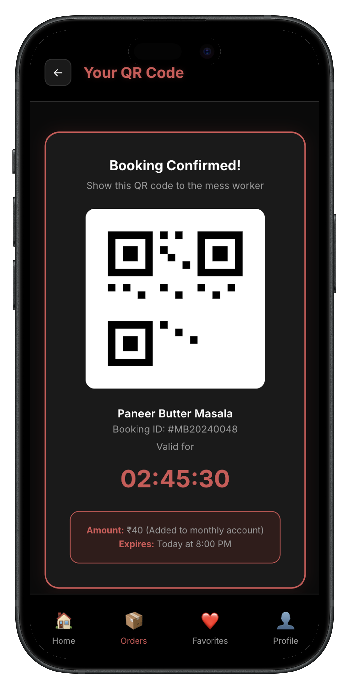
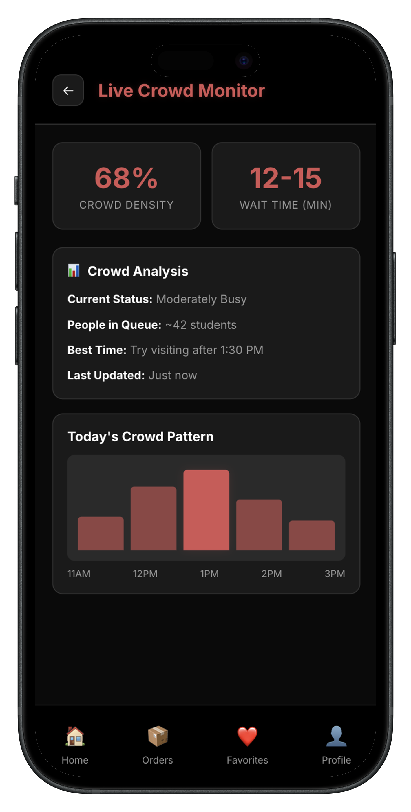
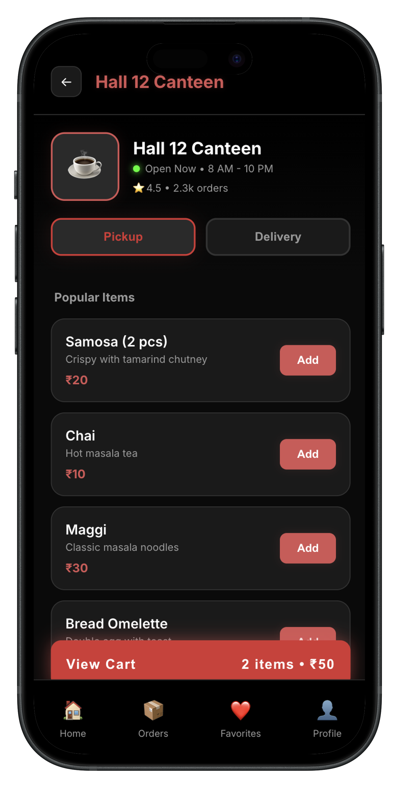

<h1 align="center">
  <br>
  
  <br><br>
  A Unified Campus Dining Platform
  <br>
</h1>

<p align="center">
  <strong>IIT Kanpur &nbsp;|&nbsp; CS253 -- Software Development and Operations &nbsp;|&nbsp; Group 18 -- HiveMinds</strong>
</p>

<p align="center">
  <code>Django REST</code> &nbsp;
  <code>React 18</code> &nbsp;
  <code>FastAPI</code> &nbsp;
  <code>YOLOv8</code> &nbsp;
  <code>PostgreSQL</code> &nbsp;
  <code>Redis</code> &nbsp;
  <code>Docker Compose</code> &nbsp;
  <code>WebSockets</code>
</p>

---

## About

UpsideDine is a full-stack campus dining platform built for IIT Kanpur that addresses the inefficiencies of mess and canteen operations across 14+ residential halls. Born from a survey of 160+ students where **85% said they delay meals to avoid crowds** and **89% wanted remote canteen ordering**, the platform digitizes the entire dining experience.

The system replaces paper-based extras coupons with a secure QR-based token system, provides real-time crowd monitoring using computer vision, enables remote food ordering with integrated payments, and manages a complete delivery logistics pipeline -- all within a single, role-based application serving students, mess managers, canteen managers, mess workers, delivery coordinators, and administrators.

Deployed on an IITK server behind an Ngrok tunnel to bypass campus firewall restrictions, the platform runs as a containerized microservice architecture with 9 Docker containers orchestrated via Docker Compose.

---

## Live Demo and Download

| | |
|---|---|
| **Live Application** | [cushy-chanda-unmaltable.ngrok-free.dev](https://cushy-chanda-unmaltable.ngrok-free.dev) |
| **Android APK** | [`upside_dine.apk`](upside_dine.apk) -- download and install directly on any Android device |


> **Note:** The live deployment runs on an IITK campus server. Availability depends on the server being online and the Ngrok tunnel being active.

---

## Core Features

| Feature | Description |
|---|---|
| **Digital Extras Booking** | Students book mess extras from the daily menu and receive a time-limited QR code. Mess workers scan the QR at the counter to verify and redeem the booking. Replaces the legacy paper coupon system entirely. |
| **Smart Crowd Monitoring** | A YOLOv8-based person detection model polls live camera feeds from mess halls, calculates real-time crowd density percentages, estimates wait times, and recommends the best time to visit. Results are pushed via Redis and consumed by the frontend over WebSockets. |
| **Remote Canteen Ordering** | Students browse canteen menus, add items to cart, and checkout with Razorpay-integrated payments (UPI, cards). Orders support both pickup and delivery modes with live status tracking. |
| **Delivery Logistics** | Canteen managers assign ready orders to delivery coordinators. Coordinators accept deliveries, pick up from the canteen, and close the order by entering the student's OTP -- ensuring verified handoff at every step. |

---

## The Ecosystem

The platform operates on a **3-tier role hierarchy** with 6 distinct user roles, each with their own dedicated dashboard and permission scope.

<p align="center">
  
</p>

---

## System Architecture

A 5-layer, **9-container** Docker Compose stack with external service integrations.

<p align="center">
  
</p>

**Layer breakdown:**

- **Client** -- React 18 PWA built with Vite, TailwindCSS, Zustand (state), React Query (server state), and Capacitor (Android APK). Communicates via REST and WebSocket.
- **Gateway** -- Nginx reverse proxy routing `/` to the frontend, `/api/` to Django, `/ws/` to Daphne, and `/static/` to the shared volume.
- **Application** -- Django REST API (users, mess, canteen, orders, payments, crowd modules with JWT auth and RBAC), Daphne ASGI server (Django Channels WebSocket for real-time order and crowd updates), and a FastAPI + YOLOv8 ML service for crowd detection.
- **Background** -- Celery Worker for async task processing (email OTPs, payment webhooks) and Celery Beat for scheduled jobs (booking expiry, daily inventory resets).
- **Data** -- PostgreSQL 14 as the primary relational database and Redis 7 serving triple duty as cache, Celery message broker, and Channels pub/sub backend.

**External Services:** Razorpay (payments, webhooks, UPI, refunds), Brevo SMTP (OTP email delivery), IP Cameras (RTSP/HTTP feeds for crowd monitoring).

---

## Deployment

<p align="center">
  
</p>

The entire stack is deployed on a single IITK server. An **Ngrok tunnel** exposes the application to the public internet, bypassing the campus firewall that blocks outgoing database connections from internal servers.

---

## App Preview

<p align="center">
  
</p>

<p align="center">
  &nbsp;&nbsp;&nbsp;
  &nbsp;&nbsp;&nbsp;
  &nbsp;&nbsp;&nbsp;
  
</p>

---

## Tech Stack

| Layer | Technology |
|---|---|
| **Backend** | Python 3.10, Django 5.0, Django REST Framework, Django Channels, Daphne (ASGI), Celery, Celery Beat |
| **Frontend** | React 18, Vite 5, TailwindCSS, Zustand, React Query (TanStack), Framer Motion, React Router, Recharts, html5-qrcode |
| **ML Service** | Python 3.10, FastAPI, Ultralytics YOLOv8, OpenCV |
| **Database** | PostgreSQL 14, Redis 7 |
| **Infrastructure** | Docker Compose, Nginx, Ngrok, Capacitor (Android) |
| **External** | Razorpay (Payments), Brevo (Email/SMTP), IP Cameras (RTSP) |
| **Auth** | JWT (SimpleJWT), OTP-based email verification, Role-Based Access Control |
| **API Docs** | drf-spectacular (OpenAPI 3.0), Swagger UI, ReDoc |
| **Testing** | pytest, pytest-django, Vitest, React Testing Library |
| **Quality** | Black, isort, flake8, mypy, ESLint, Prettier |

---

## Quick Start with Docker

### Prerequisites

- [Docker](https://docs.docker.com/get-docker/) and [Docker Compose](https://docs.docker.com/compose/install/) installed on your machine.

### Steps

**1. Clone the repository**

```bash
git clone https://github.com/karankk-05/upside-dine.git
cd upside-dine
```

**2. Set up environment files**

```bash
cp backend/.env.example backend/.env
cp frontend/.env.example frontend/.env
```

Edit `backend/.env` with your credentials (database, email, Razorpay keys). The defaults work for local development with Docker.

**3. Build and start all services**

```bash
docker compose up --build
```

This will start all 9 containers: PostgreSQL, Redis, Django backend, Celery worker, Celery beat, Daphne (WebSocket), FastAPI ML service, React frontend, and Nginx.

**4. Access the application**

| Service | URL |
|---|---|
| Application | [http://localhost:48080](http://localhost:48080) |
| API Docs (Swagger) | [http://localhost:48080/api/docs/](http://localhost:48080/api/docs/) |
| API Docs (ReDoc) | [http://localhost:48080/api/redoc/](http://localhost:48080/api/redoc/) |
| Database Admin | [http://localhost:9090](http://localhost:9090) |

**5. Stop all services**

```bash
docker compose down
```

To also remove persisted data (database, media):

```bash
docker compose down -v
```

---

## Project Structure

```
upside-dine/
|-- backend/                  # Django REST API
|   |-- apps/
|   |   |-- users/            # Authentication, roles, OTP
|   |   |-- mess/             # Mess management, extras booking
|   |   |-- canteen/          # Canteen menus, categories
|   |   |-- orders/           # Order lifecycle, delivery
|   |   |-- payments/         # Razorpay integration
|   |   |-- crowd/            # Camera feed management
|   |-- api/                  # Health checks, shared endpoints
|   |-- config/               # Django settings, ASGI, Celery
|   |-- Dockerfile
|   `-- requirements.txt
|-- frontend/                 # React 18 PWA
|   |-- src/
|   |   |-- features/         # Auth, mess, canteen, ML modules
|   |   |-- pages/            # Dashboard pages per role
|   |   |-- components/       # Shared UI components
|   |   |-- stores/           # Zustand state stores
|   |   |-- hooks/            # Custom React hooks
|   |   `-- lib/              # API client, query config
|   |-- Dockerfile
|   `-- package.json
|-- ml_service/               # FastAPI + YOLOv8
|   |-- models/               # YOLO detector wrapper
|   |-- services/             # Crowd analyzer, video processor
|   |-- main.py               # FastAPI application
|   |-- Dockerfile
|   `-- requirements.txt
|-- nginx/
|   `-- nginx.conf            # Reverse proxy configuration
|-- docker-compose.yml        # Full stack orchestration
|-- docs/                     # Project documentation (SRS, design specs, etc.)
`-- .gitignore
```

---

## Detailed Documentation

| Component | README |
|---|---|
| Backend (Django REST API) | [backend/README.md](backend/README.md) |
| Frontend (React PWA) | [frontend/README.md](frontend/README.md) |
| ML Service (FastAPI + YOLOv8) | [ml_service/README.md](ml_service/README.md) |
| Infrastructure (Docker + Nginx) | [docker/README.md](docker/README.md) |

---

## Documentation

The `docs/` directory contains the complete project documentation:

- **SRS** -- Software Requirements Specification
- **Design Specifications** -- System and UI design document
- **Implementation** -- Implementation details and decisions
- **Test Document** -- Testing strategy, test cases, and results
- **User Manual** -- End-user guide for all roles
- **Presentation** -- Final project presentation

---

<p align="center">
  <sub>Built by HiveMinds (Group 18) for CS253 at IIT Kanpur</sub>
</p>
