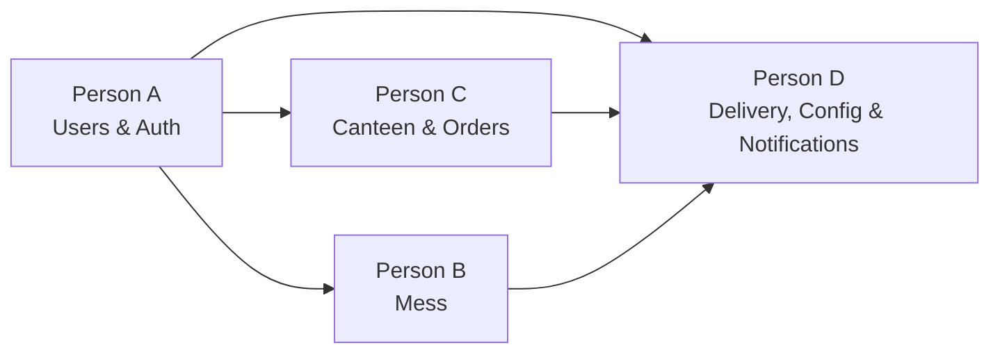

# Backend & Server Deployment — Work Distribution (4 People)

> **Project**: UpsideDine | **Tech Stack**: Django 5, DRF, PostgreSQL, Redis, Celery, Channels, FastAPI (ML), Docker, Nginx
>
> **Guiding Principle**: Each person owns **separate Django apps** (directories) so that parallel work produces **zero merge conflicts** on GitHub. Shared touchpoints (`settings.py`, `config/urls.py`, `docker-compose.yml`) are edited only by one designated person or at pre-agreed integration points.

---

## Architecture Quick-Reference

```
backend/
├── config/                  # Django project config (shared — Person D owns)
│   ├── settings.py
│   ├── urls.py              # Root URL includes — each person adds their own app's include
│   ├── celery.py
│   └── asgi.py
├── apps/
│   ├── users/               # Person A
│   ├── mess/                # Person B
│   ├── canteen/             # Person C
│   ├── orders/              # Person C
│   ├── payments/            # Person C
│   ├── notifications/       # Person D
│   ├── crowd/               # Person D
│   └── delivery/            # Person D
├── ml_service/              # Person D (FastAPI microservice)
├── api/                     # Existing — deprecate or keep as legacy health check
├── requirements.txt         # Person D owns; others request additions via PR
├── Dockerfile
└── manage.py
```

---

## Conflict-Avoidance Rules

| Rule | Details |
|------|---------|
| **Own your app directories** | Each person creates, edits, and tests only their own `apps/<name>/` directories. |
| **One person owns `config/`** | Person D is the config owner. Others submit changes to `settings.py`, `config/urls.py`, `requirements.txt` via small PRs or pair them with Person D. |
| **Root URL pattern** | Each person creates their app-level `urls.py` and tells Person D the single `include()` line to add. |
| **Shared models convention** | If you reference another person's model, import it; don't copy it. Agree on model names + primary key fields upfront (this doc does that). |
| **Migrations** | Run `makemigrations <your_app>` only for your own apps. Never touch another app's migration files. |
| **Branch naming** | `personA/auth-models`, `personB/mess-extras-api`, etc. Each person merges their own branches. |
| **Integration PRs** | When two apps need to interact (e.g., orders → notifications), the dependent person opens a PR against `main` after the dependency is merged. |

---

## Person A — Authentication & User Management

**Django apps owned**: `apps/users/`

### What to build

#### 1. Custom User Model & Roles (`apps/users/models.py`)
- Custom `User` model extending `AbstractBaseUser` + `PermissionsMixin`
  - Fields: `email` (login field), `phone`, `role` (FK → `Role`), `is_verified`, `is_active`, `date_joined`
- `Role` model: `role_name` (student / mess_manager / mess_worker / canteen_manager / delivery_person), `description`
- `Student` profile model (1-to-1 → User): `roll_number`, `full_name`, `hostel_name`, `room_number`
- `Staff` profile model (1-to-1 → User): `full_name`, `employee_code`, `canteen_id` (FK → canteen, nullable), `is_mess_staff`
- `MessAccount` model (1-to-1 → Student): `balance`, `last_updated`
- `UserToken` model: `user` (FK), `refresh_token`, `device_info`, `ip_address`, `expires_at`, `is_revoked`

#### 2. Auth API Endpoints (`apps/users/views.py`, `serializers.py`, `urls.py`)
| Endpoint | Method | Description |
|----------|--------|-------------|
| `/api/auth/register/` | POST | Register with @iitk.ac.in email, send OTP |
| `/api/auth/verify-otp/` | POST | Verify OTP, complete registration |
| `/api/auth/login/` | POST | Email + password → JWT access + refresh tokens |
| `/api/auth/refresh/` | POST | Refresh access token |
| `/api/auth/logout/` | POST | Blacklist refresh token |
| `/api/auth/forgot-password/` | POST | Send OTP for password reset |
| `/api/auth/reset-password/` | POST | Verify OTP + set new password |
| `/api/users/me/` | GET/PATCH | Get/update current user profile |
| `/api/users/me/mess-account/` | GET | Get mess account balance & history |

#### 3. OTP System (`apps/users/services.py`)
- Generate 6-digit OTP, store in Redis (`otp:email:{email}`, TTL 5 min)
- Rate-limit OTP attempts (`otp:attempts:{email}`, TTL 1 hour)
- Send OTP via Django email backend (SMTP)

#### 4. JWT & Permissions (`apps/users/authentication.py`, `permissions.py`)
- Configure `djangorestframework-simplejwt` (access 30 min, refresh 7 days)
- Token blacklisting via Redis (`blacklist:token:{jti}`)
- Custom permission classes: `IsStudent`, `IsMessManager`, `IsMessWorker`, `IsCanteenManager`, `IsDeliveryPerson`, `IsAdminRole`
- Session tracking in Redis (`session:{user_id}:{device_id}`)

#### 5. Rate Limiting Middleware (`apps/users/middleware.py`)
- Redis-based rate limiting (`ratelimit:api:{user_id}` → 1 min TTL, `ratelimit:login:{email}` → 15 min TTL)

#### 6. Admin Panel Setup
- Register all `users` app models in Django admin
- Configure admin site branding

### Files created/modified
```
apps/users/__init__.py
apps/users/models.py
apps/users/serializers.py
apps/users/views.py
apps/users/urls.py
apps/users/admin.py
apps/users/services.py          # OTP logic, email sending
apps/users/authentication.py    # JWT customization
apps/users/permissions.py       # Role-based permission classes
apps/users/middleware.py         # Rate limiting
apps/users/managers.py           # Custom user manager
apps/users/tests/                # Unit tests for auth flows
```

### SRS Requirements Covered
F1.1 – F1.8 (Authentication & User Management)

---

## Person B — Mess Operations (Extras Booking + QR Verification)

**Django apps owned**: `apps/mess/`

### What to build

#### 1. Mess Models (`apps/mess/models.py`)
- `Mess` model: `name`, `location`, `hall_name`, `is_active`
- `MessMenuItem` model: `mess` (FK), `item_name`, `description`, `price`, `meal_type` (breakfast/lunch/dinner/snack), `day_of_week`, `available_quantity`, `image_url`, `is_active`
- `MessBooking` model: `student` (FK → Student), `menu_item` (FK), `quantity`, `total_price`, `meal_type`, `booking_date`, `qr_code` (unique token), `qr_generated_at`, `qr_expires_at`, `status` (pending/redeemed/expired/cancelled), `redeemed_at`, `redeemed_by_staff` (FK → Staff)

#### 2. Student Mess API Endpoints
| Endpoint | Method | Description |
|----------|--------|-------------|
| `/api/mess/` | GET | List all messes |
| `/api/mess/{id}/menu/` | GET | Get menu items for a mess (filterable by meal_type, day) |
| `/api/mess/extras/book/` | POST | Book extras → generate QR code |
| `/api/mess/bookings/` | GET | Student's booking history |
| `/api/mess/bookings/{id}/` | GET | Booking detail with QR code |
| `/api/mess/bookings/{id}/cancel/` | POST | Cancel a pending booking |

#### 3. Mess Manager API Endpoints
| Endpoint | Method | Description |
|----------|--------|-------------|
| `/api/mess/manager/menu/` | GET/POST | List / add menu items |
| `/api/mess/manager/menu/{id}/` | PATCH/DELETE | Update / deactivate items |
| `/api/mess/manager/bookings/` | GET | Today's bookings with stats |
| `/api/mess/manager/stats/` | GET | Booking statistics (total, redeemed count) |
| `/api/mess/manager/inventory/` | GET/PATCH | View/update stock levels |

#### 4. Mess Worker (QR Verification) API Endpoints
| Endpoint | Method | Description |
|----------|--------|-------------|
| `/api/mess/worker/verify/` | POST | Verify QR code / booking ID → mark redeemed |
| `/api/mess/worker/scan-history/` | GET | Recent scan history for current session |

#### 5. QR Code Service (`apps/mess/services.py`)
- Generate unique QR code tokens (UUID-based)
- QR code validity (default 3 hours from generation)
- QR code image generation (using `qrcode` library)
- Validation logic: check existence, expiry, redeemed status, prevent reuse

#### 6. Celery Tasks (`apps/mess/tasks.py`)
- Auto-expire bookings past QR validity window (periodic task every 5 min)
- Daily reset of `available_quantity` for menu items (scheduled at midnight)

#### 7. Mess Account Integration
- When a booking is confirmed, debit the student's `MessAccount` balance (import from `apps.users.models`)
- Provide utility to update balance

### Files created/modified
```
apps/mess/__init__.py
apps/mess/models.py
apps/mess/serializers.py
apps/mess/views.py
apps/mess/urls.py
apps/mess/admin.py
apps/mess/services.py           # QR generation, validation logic
apps/mess/tasks.py              # Celery periodic tasks
apps/mess/filters.py            # DjangoFilter filters
apps/mess/tests/                # Unit tests
```

### SRS Requirements Covered
F2.1 – F2.9 (Student Mess Features), F5.1 – F5.6 (Mess Manager), F6.1 – F6.9 (Mess Coordinator/Worker)

---

## Person C — Canteen Operations (Menu, Orders, Cart, Payments)

**Django apps owned**: `apps/canteen/`, `apps/orders/`, `apps/payments/`

### What to build

#### 1. Canteen Models (`apps/canteen/models.py`)
- `Canteen` model: `name`, `location`, `contact_phone`, `opening_time`, `closing_time`, `is_delivery_available`, `min_order_amount`, `delivery_fee`, `is_active`, `rating` (computed/cached)
- `CanteenMenuCategory` model: `canteen` (FK), `category_name`, `display_order`, `is_active`
- `CanteenMenuItem` model: `canteen` (FK), `category` (FK), `item_name`, `description`, `price`, `preparation_time_mins`, `is_veg`, `is_available`, `available_quantity`, `image_url`, `is_active`

#### 2. Canteen API Endpoints
| Endpoint | Method | Description |
|----------|--------|-------------|
| `/api/canteens/` | GET | List all canteens with status |
| `/api/canteens/{id}/` | GET | Canteen detail (info + rating + hours) |
| `/api/canteens/{id}/menu/` | GET | Menu items grouped by category |
| `/api/canteens/{id}/categories/` | GET | List categories |
| `/api/canteens/search/` | GET | Search menu items across canteens |

#### 3. Order Models (`apps/orders/models.py`)
- `CanteenOrder` model: `order_number` (auto-generated unique), `student` (FK), `canteen` (FK), `order_type` (pickup/delivery/prebooking), `scheduled_time`, `subtotal`, `delivery_fee`, `total_amount`, `status` (pending → confirmed → preparing → ready → out_for_delivery → delivered/picked_up/cancelled), `delivery_address`, `estimated_ready_time`, `notes`, `pickup_qr_code`, `pickup_otp`
- `CanteenOrderItem` model: `order` (FK), `menu_item` (FK), `quantity`, `unit_price`, `total_price`, `special_instructions`

#### 4. Order API Endpoints
| Endpoint | Method | Description |
|----------|--------|-------------|
| `/api/orders/` | POST | Place order (validate items, calculate totals) |
| `/api/orders/` | GET | Student's order history |
| `/api/orders/{id}/` | GET | Order detail with status timeline |
| `/api/orders/{id}/cancel/` | POST | Cancel order (only before preparation) |
| `/api/orders/{id}/status/` | GET | Quick status check |

#### 5. Canteen Manager API Endpoints
| Endpoint | Method | Description |
|----------|--------|-------------|
| `/api/canteen-manager/orders/` | GET | All incoming orders (real-time) |
| `/api/canteen-manager/orders/{id}/accept/` | POST | Accept order |
| `/api/canteen-manager/orders/{id}/reject/` | POST | Reject order |
| `/api/canteen-manager/orders/{id}/status/` | PATCH | Update status (preparing/ready) |
| `/api/canteen-manager/orders/{id}/verify-pickup/` | POST | Verify pickup QR/OTP |
| `/api/canteen-manager/menu/` | GET/POST | Manage menu items |
| `/api/canteen-manager/menu/{id}/` | PATCH/DELETE | Update/delete items |
| `/api/canteen-manager/categories/` | GET/POST | Manage categories |
| `/api/canteen-manager/stats/` | GET | Daily order stats & revenue |

#### 6. Payment Models & Integration (`apps/payments/models.py`)
- `Payment` model: `order` (1-to-1 → CanteenOrder), `razorpay_order_id`, `razorpay_payment_id`, `razorpay_signature`, `amount`, `currency` (default INR), `status` (pending/authorized/captured/failed/refunded), `payment_method`, `failure_reason`, `refund_amount`, `refunded_at`, `captured_at`

#### 7. Payment API Endpoints
| Endpoint | Method | Description |
|----------|--------|-------------|
| `/api/payments/create-order/` | POST | Create Razorpay order for a canteen order |
| `/api/payments/verify/` | POST | Verify Razorpay payment (signature verification) |
| `/api/payments/webhook/` | POST | Razorpay webhook handler (payment.captured, refund.processed) |
| `/api/payments/{order_id}/refund/` | POST | Initiate refund |
| `/api/payments/{order_id}/status/` | GET | Payment status |

#### 8. Order Processing Services
- Order number generation (e.g., `UD-YYYYMMDD-XXXX`)
- Pickup QR/OTP generation for self-pickup orders
- Order total calculation with delivery fee logic
- Stock validation before order confirmation

### Files created/modified
```
apps/canteen/__init__.py
apps/canteen/models.py
apps/canteen/serializers.py
apps/canteen/views.py
apps/canteen/urls.py
apps/canteen/admin.py
apps/canteen/filters.py
apps/canteen/tests/

apps/orders/__init__.py
apps/orders/models.py
apps/orders/serializers.py
apps/orders/views.py
apps/orders/urls.py
apps/orders/admin.py
apps/orders/services.py         # Order processing, validation
apps/orders/tests/

apps/payments/__init__.py
apps/payments/models.py
apps/payments/serializers.py
apps/payments/views.py
apps/payments/urls.py
apps/payments/admin.py
apps/payments/services.py       # Razorpay integration
apps/payments/tests/
```

### SRS Requirements Covered
F4.1 – F4.13 (Student Canteen Ordering), F7.1 – F7.11 (Canteen Manager)

---

## Person D — Delivery, Notifications, Crowd Monitoring, ML & Deployment

**Django apps owned**: `apps/delivery/`, `apps/notifications/`, `apps/crowd/`
**Also owns**: `config/` directory, `requirements.txt`, `docker-compose.yml`, `.env.example`, `ml_service/`, `nginx/nginx.conf`

### What to build

#### 1. Delivery Models (`apps/delivery/models.py`)
- `OrderDelivery` model: `order` (1-to-1 → CanteenOrder), `delivery_person` (FK → Staff), `assigned_at`, `picked_up_at`, `delivered_at`, `status` (pending/assigned/picked_up/in_transit/delivered/failed), `failure_reason`, `delivery_notes`, `recipient_name`, `photo_proof_url`

#### 2. Delivery Coordinator API Endpoints
| Endpoint | Method | Description |
|----------|--------|-------------|
| `/api/delivery/status/` | GET/PATCH | Get/toggle availability (active/offline) |
| `/api/delivery/available-orders/` | GET | List delivery orders available for pickup |
| `/api/delivery/orders/{id}/accept/` | POST | Accept a delivery assignment |
| `/api/delivery/orders/{id}/picked-up/` | POST | Mark picked up from canteen |
| `/api/delivery/orders/{id}/delivered/` | POST | Mark delivered + optional photo proof |
| `/api/delivery/history/` | GET | Delivery history |
| `/api/delivery/earnings/` | GET | Today's earnings |
| `/api/delivery/assign/` | POST | (Canteen manager) Assign order to coordinator |

#### 3. Delivery Service (`apps/delivery/services.py`)
- Auto-assignment logic (pick nearest available coordinator)
- Earnings calculation (based on delivery fees)
- Redis-based delivery location tracking (`delivery:location:{delivery_id}`)

#### 4. Notification System (`apps/notifications/`)

**Models** (`apps/notifications/models.py`):
- `Notification` model: `user` (FK), `title`, `body`, `notification_type` (order_update/delivery_update/qr_expiry/new_order/delivery_assignment), `data` (JSONField for payload), `is_read`, `created_at`
- `FCMDevice` model: `user` (FK), `registration_token`, `device_type`, `is_active`

**API Endpoints**:
| Endpoint | Method | Description |
|----------|--------|-------------|
| `/api/notifications/` | GET | List user's notifications |
| `/api/notifications/read/` | POST | Mark notifications as read |
| `/api/notifications/register-device/` | POST | Register FCM device token |

**Celery Tasks** (`apps/notifications/tasks.py`):
- `send_push_notification(user_id, title, body, data)` — Send via Firebase Cloud Messaging
- `send_order_status_notification(order_id, new_status)` — Triggered on order status change
- `send_delivery_assignment_notification(delivery_id)` — Notify delivery coordinator
- `send_qr_expiry_warning(booking_id)` — 15 min before QR expiry
- `send_email_notification(to_email, subject, body)` — Transactional emails (order confirmation)

#### 5. WebSocket / Real-Time (`apps/notifications/consumers.py`, `routing.py`)
- `OrderStatusConsumer`: WebSocket consumer for real-time order status updates
  - Channel group: `order_{order_id}`
  - Events: status_update, delivery_location_update
- `CrowdMonitorConsumer`: WebSocket consumer for live crowd data
  - Channel group: `crowd_mess_{mess_id}`
  - Events: density_update, wait_time_update
- Update `config/asgi.py` with WebSocket routing

#### 6. Crowd Monitoring (`apps/crowd/`)

**Models** (`apps/crowd/models.py`):
- `CameraFeed` model: `mess` (FK → Mess), `camera_url` (RTSP URL), `is_active`, `location_description`
- `CrowdMetric` model: `mess` (FK), `density_percentage`, `estimated_count`, `density_level` (low/moderate/high), `estimated_wait_minutes`, `recorded_at`

**API Endpoints**:
| Endpoint | Method | Description |
|----------|--------|-------------|
| `/api/crowd/mess/{id}/live/` | GET | Current crowd density + wait time (from Redis) |
| `/api/crowd/mess/{id}/history/` | GET | Hourly crowd history for today |
| `/api/crowd/mess/{id}/recommendation/` | GET | Best time to visit |

**Celery Tasks** (`apps/crowd/tasks.py`):
- Poll ML service every 30 seconds → update Redis cache (`crowd:mess:{mess_id}:density`)
- Store hourly aggregates in `CrowdMetric` model for historical trends
- Push live updates via WebSocket

#### 7. FastAPI ML Microservice (`ml_service/`)
```
ml_service/
├── main.py              # FastAPI app
├── models/              # ML model files
│   └── crowd_detector.py
├── services/
│   └── video_processor.py   # RTSP frame extraction
├── schemas.py           # Pydantic request/response models
├── config.py            # Settings
├── Dockerfile
└── requirements.txt
```

**ML Service Endpoints**:
| Endpoint | Method | Description |
|----------|--------|-------------|
| `/ml/crowd/analyze` | POST | Receive frame/feed URL → return count + density |
| `/ml/health` | GET | Service health check |

#### 8. Project Config & Integration Duties
- Update `settings.py`: `AUTH_USER_MODEL`, INSTALLED_APPS for all apps, JWT config, email config
- Update `config/urls.py`: manage root route definitions and include other people's routers
- Update `requirements.txt` as others request new dependencies via PR
- Keep `.env.example` correctly updated with all environment variables
- Coordinate Integration testing across apps

#### 9. Server Deployment & Infrastructure
- **Nginx config** (`nginx/nginx.conf`): SSL termination, reverse proxy for backend (8000), WebSocket (8001), frontend (3000), static/media file serving
- **Docker updates**: Maintain `docker-compose.yml`, coordinate volumes and networking bridging ML, backend, Redis, Postgres
- **Gunicorn config**: Production-ready worker config (`gunicorn.conf.py`)
- **Production settings**: `settings_production.py` with `DEBUG=False`, security headers, HSTS
- **CI/CD base**: GitHub Actions workflow for lint + test + build (`.github/workflows/ci.yml`)

### Files created/modified
```
apps/delivery/__init__.py
apps/delivery/models.py
apps/delivery/serializers.py
apps/delivery/views.py
apps/delivery/urls.py
apps/delivery/admin.py
apps/delivery/services.py
apps/delivery/tests/

apps/notifications/__init__.py
apps/notifications/models.py
apps/notifications/serializers.py
apps/notifications/views.py
apps/notifications/urls.py
apps/notifications/admin.py
apps/notifications/tasks.py          # Celery tasks for push + email
apps/notifications/consumers.py      # WebSocket consumers
apps/notifications/routing.py        # WebSocket URL routes
apps/notifications/services.py       # FCM integration
apps/notifications/tests/

apps/crowd/__init__.py
apps/crowd/models.py
apps/crowd/serializers.py
apps/crowd/views.py
apps/crowd/urls.py
apps/crowd/admin.py
apps/crowd/tasks.py
apps/crowd/tests/

ml_service/main.py
ml_service/models/crowd_detector.py
ml_service/services/video_processor.py
ml_service/schemas.py
ml_service/config.py
ml_service/Dockerfile
ml_service/requirements.txt

config/settings.py                  # (updated)
config/urls.py                      # (updated)
requirements.txt                    # (updated)
.env.example                        # (updated)
nginx/nginx.conf                    # (updated)
config/asgi.py                      # (updated — WebSocket routing)
docker-compose.yml                  # (updated — ML service added)
.github/workflows/ci.yml           # (new)
```

### SRS Requirements Covered
F3.1 – F3.8 (Crowd Monitoring), F8.1 – F8.10 (Delivery Coordinator), F9.1 – F9.6 (Notifications), Deployment

---

## Cross-Person Dependencies & Integration Order




### Shared Model Import Map

| If you need... | Import from... |
|----------------|----------------|
| `User`, `Student`, `Staff`, `MessAccount`, `Role` | `apps.users.models` |
| `Mess`, `MessMenuItem`, `MessBooking` | `apps.mess.models` |
| `Canteen`, `CanteenMenuItem`, `CanteenMenuCategory` | `apps.canteen.models` |
| `CanteenOrder`, `CanteenOrderItem` | `apps.orders.models` |
| `Payment` | `apps.payments.models` |
| `OrderDelivery` | `apps.delivery.models` |
| `Notification`, `FCMDevice` | `apps.notifications.models` |
| Permission classes (`IsStudent`, etc.) | `apps.users.permissions` |

---

## Summary Table

| Person | Django Apps | Key Responsibilities | SRS Reqs |
|--------|-----------|---------------------|----------|
| **A** | `users` | Custom User model, Auth (register/login/OTP/JWT), role permissions, rate limiting | F1.1–F1.8 |
| **B** | `mess` | Mess menu, extras booking, QR code generation/verification, mess manager/worker APIs, Celery expiry tasks | F2.1–F2.9, F5.1–F5.6, F6.1–F6.9 |
| **C** | `canteen`, `orders`, `payments` | Canteen menu & categories, order placement/tracking, Razorpay payment integration, canteen manager APIs | F4.1–F4.13, F7.1–F7.11 |
| **D** | `delivery`, `notifications`, `crowd`, `config` | Delivery coordination, push notifications (FCM), WebSockets, crowd monitoring, FastAPI ML service, config maintenance, deployment & integrations | F3.1–F3.8, F8.1–F8.10, F9.1–F9.6 |
